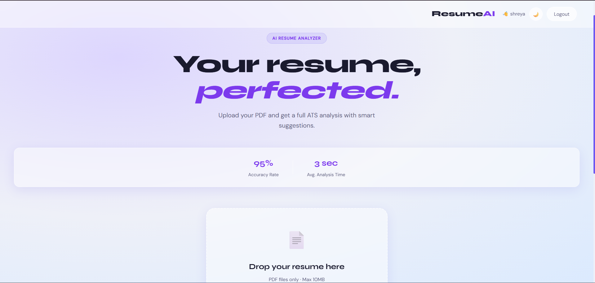

# ResumeAI 🧠

An AI-powered resume analyzer that gives you an ATS score, highlights strengths and weaknesses, and suggests improvements — in seconds.

---

## Features

- 📊 **ATS Score** — instant score out of 100 with color-coded rating (green / orange / red)
- 💪 **Strengths & Weaknesses** — top 3 of each, clearly listed
- 💡 **Improvement Suggestions** — 5 actionable recommendations
- ⬇️ **Download Report** — save your analysis as a `.txt` file
- 📋 **Upload History** — tracks your past scans per user (stored locally)
- 🌙 **Dark / Light Mode** — glassmorphism UI with theme toggle
- 🔒 **Privacy first** — your resume is never stored on the server

---

## Tech Stack

| Layer     | Technology              |
|-----------|-------------------------|
| Frontend  | HTML, CSS, Vanilla JS   |
| Backend   | FastAPI (Python)        |
| AI Model  | Groq API — LLaMA 3.3 70B|
| PDF Parse | PyMuPDF (fitz)          |

---

## Project Structure